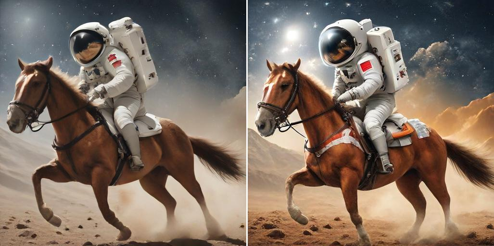
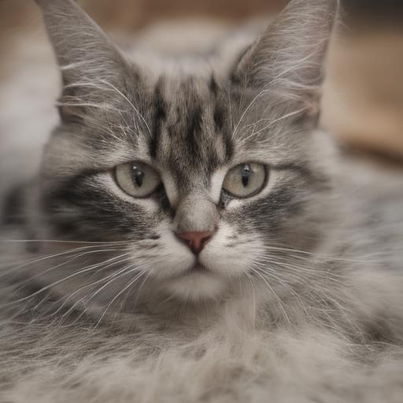
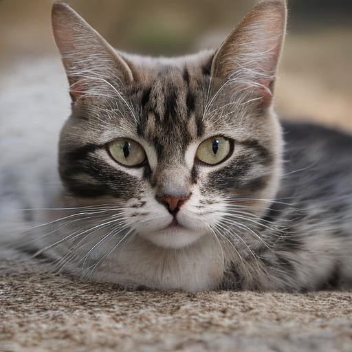
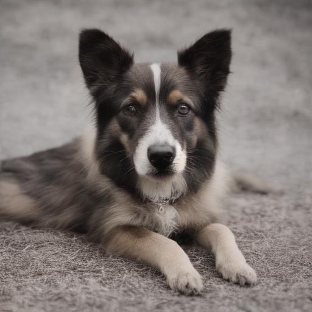
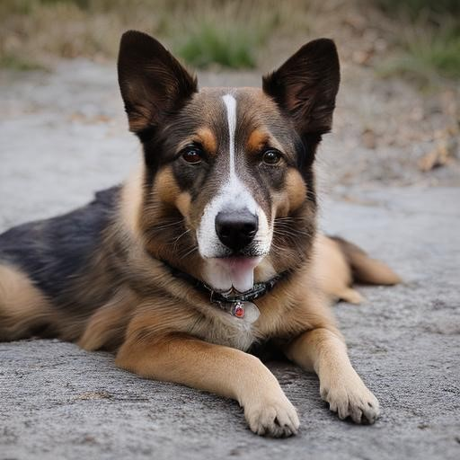
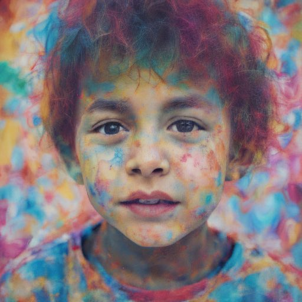
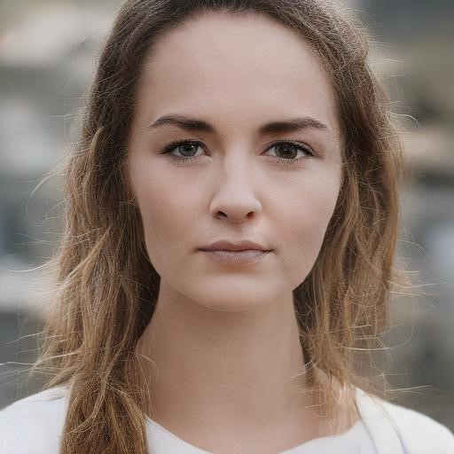

# Enhancing Diffusion Models with Text-Encoder Reinforcement Learning

Official PyTorch codes for paper [Enhancing Diffusion Models with Text-Encoder Reinforcement Learning](https://arxiv.org/abs/2311.15657)

[](https://arxiv.org/abs/2311.15657)
<a href="https://colab.research.google.com/drive/1pC6lzFR4hohwWyBgnkeZUghi2jqjl9gI?usp=sharing"></a> 
[](https://huggingface.co/chaofengc/sd-turbo_texforce)


## Requirements & Installation

- Clone the repo and install required packages with 
```
# git clone this repository
git clone https://github.com/chaofengc/TexForce.git
cd TexForce 

# create new anaconda env
conda create -n texforce python=3.8
source activate texforce 

# install python dependencies
pip3 install -r requirements.txt
```

## Results on SDXL-Turbo

We also applied our method to the recent model [sdxl-turbo](https://huggingface.co/stabilityai/sdxl-turbo). The model is trained with [Q-Instruct](https://github.com/Q-Future/Q-Instruct) feedback through direct back-propagation to save training time. Test with the following codes

```
## Note: sdturbo requires latest diffusers installed from source with the following command
git clone https://github.com/huggingface/diffusers
cd diffusers
pip install -e .
```
```
from diffusers import AutoPipelineForText2Image
import torch

pipe = AutoPipelineForText2Image.from_pretrained("stabilityai/sd-turbo", torch_dtype=torch.float16, variant="fp16")
pipe = pipe.to("cuda")
pipe.load_lora_weights('chaofengc/sdxl-turbo_texforce')

pt = ['a photo of a cat.']
img = pipe(prompt=pt, num_inference_steps=1, guidance_scale=0.0).images[0]
```

Here are some example results:

<table>
<thead>
  <tr>
    <th width="50%">sdxl-turbo</th>
    <th width="50%">sdxl-turbo + TexForce</th>
  </tr>
</thead>
<tbody>
  <tr>
    <td colspan="2">
      A photo of a cat.
    </td>
  </tr>
  <tr>
    <td colspan="2">
        
    </td>
  </tr>
  <tr>
    <td colspan="2">
      An astronaut riding a horse.
    </td>
  </tr>
  <tr>
    <td colspan="2">
        
    </td>
  </tr>
  <tr>
    <td colspan="2">
      water bottle.
    </td>
  </tr>
  <tr>
    <td colspan="2">
        
    </td>
  </tr>
</tbody>
</table>


## Results on SD-Turbo

We applied our method to the recent model [sdturbo](https://huggingface.co/stabilityai/sd-turbo). The model is trained with [Q-Instruct](https://github.com/Q-Future/Q-Instruct) feedback through direct back-propagation to save training time. Test with the following codes

```
## Note: sdturbo requires latest diffusers>=0.24.0 with AutoPipelineForText2Image class

from diffusers import AutoPipelineForText2Image
from peft import PeftModel
import torch

pipe = AutoPipelineForText2Image.from_pretrained("stabilityai/sd-turbo", torch_dtype=torch.float16, variant="fp16")
pipe = pipe.to("cuda")
PeftModel.from_pretrained(pipe.text_encoder, 'chaofengc/sd-turbo_texforce')

pt = ['a photo of a cat.']
img = pipe(prompt=pt, num_inference_steps=1, guidance_scale=0.0).images[0]
```

Here are some example results:

<table>
<thead>
  <tr>
    <th width="50%">sd-turbo</th>
    <th width="50%">sd-turbo + TexForce</th>
  </tr>
</thead>
<tbody>
  <tr>
    <td colspan="2">
      A photo of a cat.
    </td>
  </tr>
  <tr>
    <td>
        
    </td>
    <td>
        
    </td>
  </tr>
  <tr>
    <td colspan="2">
      A photo of a dog.
    </td>
  </tr>
  <tr>
    <td>
        
    </td>
    <td>
        
    </td>
  </tr>
  <tr>
    <td colspan="2">
      A photo of a boy, colorful.
    </td>
  </tr>
  <tr>
    <td>
        
    </td>
    <td>
        
    </td>
  </tr>

</tbody>
</table>

## Quick Test

You may simply load the pretrained lora weights with the following code block to improve performance of original stable diffusion model:
```
from diffusers import StableDiffusionPipeline
from diffusers import DDIMScheduler 
from peft import PeftModel
import torch

def load_model_weights(pipe, weight_path, model_type):
    if model_type == 'text+lora':
        text_encoder = pipe.text_encoder
        PeftModel.from_pretrained(text_encoder, weight_path)
    elif model_type == 'unet+lora':
        pipe.unet.load_attn_procs(weight_path)

device = torch.device('cuda' if torch.cuda.is_available() else 'cpu')

model_id = "CompVis/stable-diffusion-v1-4"
pipe = StableDiffusionPipeline.from_pretrained(model_id, dtype=torch.float16)
pipe = pipe.to("cuda")
pipe.scheduler = DDIMScheduler.from_config(pipe.scheduler.config)

load_model_weights(pipe, './lora_weights/sd14_refl/', 'unet+lora')
load_model_weights(pipe, './lora_weights/sd14_texforce/', 'text+lora')

prompt = ['a painting of a dog.']
img = pipe(prompt).images[0]

```

Here are some example results:

<table>
<thead>
  <tr>
    <th width="25%">SDv1.4</th>
    <th width="25%">ReFL</th>
    <th width="25%">TexForce</th>
    <th width="25%">ReFL+TexForce</th>
  </tr>
</thead>
<tbody>
  <tr>
    <td colspan="4">
      astronaut drifting afloat in space, in the darkness away from anyone else, alone, black background dotted with stars, realistic
    </td>
  </tr>
  <tr>
    <td colspan="4">
        
    </td>
  </tr>
  <tr>
    <td colspan="4">
      portrait of a cute cyberpunk cat, realistic, professional
    </td>
  </tr>
  <tr>
    <td colspan="4">
        
    </td>
  </tr>
  <tr>
    <td colspan="4">
      a coffee mug made of cardboard
    </td>
  </tr>
  <tr>
    <td colspan="4">
        
    </td>
  </tr>
</tbody>
</table>


## Citation

If you find this code useful for your research, please cite our paper:
```
@article{chen2023texforce,
  title={Enhancing Diffusion Models with Text-Encoder Reinforcement Learning},
  author={Chaofeng Chen and Annan Wang and Haoning Wu and Liang Liao and Wenxiu Sun and Qiong Yan and Weisi Lin},
  year={2023},
  eprint={2311.15657},
  archivePrefix={arXiv},
  primaryClass={cs.CV}
}
```

## License

This work is licensed under [NTU S-Lab License 1.0](./LICENCE_S-Lab) and a <a rel="license" href="http://creativecommons.org/licenses/by-nc-sa/4.0/">Creative Commons Attribution-NonCommercial-ShareAlike 4.0 International License</a>.

<a rel="license" href="http://creativecommons.org/licenses/by-nc-sa/4.0/"></a>
