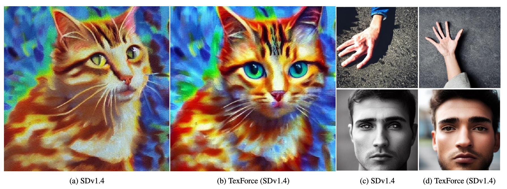

# Enhancing Diffusion Models with Text-Encoder Reinforcement Learning

Official PyTorch codes for paper [Enhancing Diffusion Models with Text-Encoder Reinforcement Learning](https://arxiv.org/abs/)


[](https://arxiv.org/abs/)
<a href="https://colab.research.google.com/drive/1Yzb4o5OKjK46jbQ-_HGFOVJOPMVtJQjw?usp=sharing"></a> 




## Requirements & Installation

- Clone the repo and install required packages with 
```
# git clone this repository
git clone https://github.com/chaofengc/TexForce.git
cd TexForce 

# create new anaconda env
conda create -n texforce python=3.8
source activate texforce 

# install python dependencies
pip3 install -r requirements.txt
```

## Quick Test

You may simply load the pretrained lora weights with the following code block to improve performance of original stable diffusion model:
```
from diffusers import StableDiffusionPipeline
from diffusers import DDIMScheduler 
from peft import PeftModel

def load_model_weights(pipe, weight_path, model_type):
    if model_type == 'text+lora':
        text_encoder = pipe.text_encoder
        PeftModel.from_pretrained(text_encoder, weight_path)
    elif model_type == 'unet+lora':
        pipe.unet.load_attn_procs(weight_path)

device = torch.device('cuda' if torch.cuda.is_available() else 'cpu')

model_id = "CompVis/stable-diffusion-v1-4"
pipe = StableDiffusionPipeline.from_pretrained(model_id)
pipe = pipe.to("cuda")
pipe.scheduler = DDIMScheduler.from_config(pipe.scheduler.config)

load_model_weights(pipe, './lora_weights/sd14_refl/', 'unet+lora')
load_model_weights(pipe, './lora_weights/sd14_texforce/', 'text+lora')

prompt = ['a painting of a dog.']
img = pipe(prompt).images[0]

```

Here are some example results:

<table>
<thead>
  <tr>
    <th width="25%">SDv1.4</th>
    <th width="25%">ReFL</th>
    <th width="25%">TexForce</th>
    <th width="25%">ReFL+TexForce</th>
  </tr>
</thead>
<tbody>
  <tr>
    <td colspan="4">
        
    </td>
  </tr>
  <tr>
    <td colspan="4">
        
    </td>
  </tr>
  <tr>
    <td colspan="4">
        
    </td>
  </tr>
</tbody>
</table>


## Citation

If you find this code useful for your research, please cite our paper:
```
@article{,
  title={Enhancing Diffusion Models with Text-Encoder Reinforcement Learning},
  author={},
  journal={},
  year={2023}
}
```

## License

<a rel="license" href="http://creativecommons.org/licenses/by-nc-sa/4.0/"></a><br />This work is licensed under a <a rel="license" href="http://creativecommons.org/licenses/by-nc-sa/4.0/">Creative Commons Attribution-NonCommercial-ShareAlike 4.0 International License</a>.
